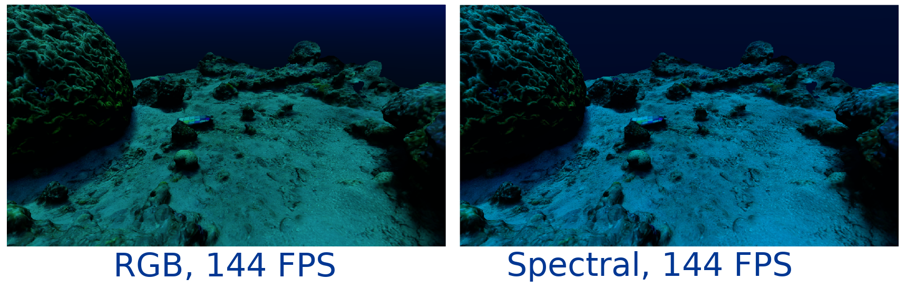

# sRAT-RT: Spectral Renderer for All-purpose Tasks, in Real Time

A spectral real-time renderer based on OpenGL 4.5 for my Master's Thesis. This renderer performs spectral upsampling of reflectances, allowing to use RGB textures and assets to perform spectral rendering.
The method we implemented is the one as in [Jakob and Hanika, 2019](https://rgl.epfl.ch/publications/Jakob2019Spectral).

## You can read the thesis [here](https://zaguan.unizar.es/record/152419/files/TAZ-TFM-2024-837.pdf)!



This project is based on the CMakeLists.txt that can be found in the repo [imgui-glfw-glad](https://github.com/cmmw/imgui-glfw-glad-glm) as a base, with some modifications to also use [assimp](https://github.com/assimp/assimp).

# Compilation instructions

With a terminal, go to the root folder of the repository and execute the following commands:

```shell
cmake -S . -B build
cmake --build build --target sRAT-RT -j4
```

It is possible to substitute the first command with a call to ```cmake``` or ```cmake-gui```.
The second command can also be replaced by a regular compilation in Visual Studio (tested with the 2019 version)

# How to use

In order to execute, you need to execute the following commands in a terminal from the ```build``` folder (Assuming Debug configuration, if otherwise, change it for Release):
```
.\Debug\sRAT-RT.exe -s ..\settings\example_settings.ini
```
If no parameter ```-s``` is specified, the configuration file might not be automatically loaded correctly, so be careful, I use ```-s``` just in case.
The aforementioned configuration file can be used to change some options, you can edit it with any regular text editor.
Once you run the program, you will have an UI to tweak some parameters and experiment with different set ups.

# Known limitations
As far as I know, PBR materials and underwater simulation are broken when used together in a scene. This shouldn't be very hard to fix, just something that got broken in the final crunch because most of my tests were done with diffuse materials instead of PBR, but I'm not contemplating fixing anything for now. I'd prefer to move on to other projects rather than polishing the same one, but if you really need that bug fixed and can't figure it out on your own, feel free to contact me!

It would also be extremely convenient to add a scene selector (and an editor in the distant future), but for now you have to edit the ```Scene::Scene()``` constructor in the ```Scene.cpp``` file.


# License
 
I used several libraries with different licenses, so I'd like to use the one that is compatible with all of those licenses (most restrictive of those) while being the one that provides the most freedom of the possible license formats.
I think assimp is the one with the most "restrictive" license, so I'll reproduce theirs in my LICENSE file.
